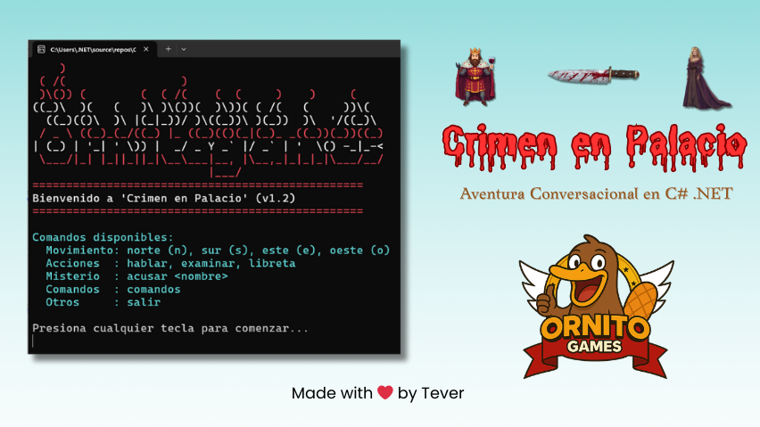

# ​🗡️​​Crimen en Palacio💉 - Aventura Conversacional
## Modo Consola .NET para C#
------------------------------------------------------------------------

## 1) 🕹️​Explicación del juego y su dinámica

**Crimen en Palacio** es un juego conversacional inspirado en el clásico
Cluedo.\
El jugador asume el rol de un **detective** que debe resolver un
asesinato en un palacio.

### Dinámica principal:

-   El detective se mueve por las distintas salas del palacio (mapa
    4x4).\
-   En cada sala puede haber **personajes** o **objetos**.\
-   El detective puede **hablar** con los personajes o **examinar** los
    objetos.\
-   Cada interacción añade una pista a la **libreta del detective**.\
-   El jugador puede revisar su libreta en cualquier momento con el
    comando `libreta`.\
-   El objetivo final es **descubrir quién es el culpable** usando el comando `acusar <nombre>`\

------------------------------------------------------------------------

## 2) 🧐​Diseño lógico del juego

### Mapa

-   Se representa con una matriz `Sala[,]` de 4x4.\
-   Algunas posiciones pueden ser `null` → esas salas no existen.\
-   Cada sala tiene una lista de salidas (`List<string>`) que indican
    las direcciones posibles.

### ​Elementos principales

-   **Sala** → contiene nombre, descripción, objeto, personaje y
    salidas.\
-   **Personaje** → tiene nombre, diálogo, estado (`Muerto`,
    `Culpable`).\
-   **Objeto** → puede ser una pista, y uno de ellos es el arma
    homicida.\
-   **Detective** → guarda todas las pistas encontradas en su libreta.

### Flujo de juego

1.  El jugador comienza en la **Sala del Trono**.\
2.  Puede moverse con `norte`, `sur`, `este`, `oeste`.\
3.  Puede usar los comandos: `hablar`, `examinar`, `libreta`, `acusar`.\
4.  El juego termina cuando:
    -   Se acusa correctamente al culpable.\
    -   El jugador decide salir (`salir`).

------------------------------------------------------------------------

## 3) 💻​Clases en C#

### Clase Detective

``` csharp
namespace CrimenEnPalacio
{
    // Clase Detective
    class Detective
    {
        public List<string> Libreta { get; set; } = new List<string>();

        public void Apuntar(string pista)
        {
            Libreta.Add(pista);
            Console.WriteLine($"Pista anotada: {pista}");
        }

        public void MostrarLibreta()
        {
            Console.WriteLine("\nLibreta del detective:");
            if (Libreta.Count == 0)
            {
                Console.WriteLine("(La libreta está vacía)");
            }
            else
            {
                foreach (var pista in Libreta)
                {
                    Console.WriteLine("- " + pista);
                }
            }
            Console.WriteLine();
        }
    }
}
```

### Clase Objeto

``` csharp
namespace CrimenEnPalacio
{
    // Clase Objeto
    class Objeto
    {
        public string Nombre { get; set; } = string.Empty;
        public string Pista { get; set; } = string.Empty;
    }
}
```

### Clase Personaje

``` csharp
namespace CrimenEnPalacio
{
    // Clase Personaje
    class Personaje
    {
        public string Nombre { get; set; } = string.Empty;
        public string Dialogo { get; set; } = string.Empty;
        public bool Muerto { get; set; } = false;
        public bool Culpable { get; set; } = false;
    }
}
```

### Clase Sala

``` csharp
namespace CrimenEnPalacio
{
    // Clase Sala
    class Sala
    {
        public string Nombre { get; set; } = string.Empty;
        public string Descripcion { get; set; } = string.Empty;
        public Objeto Objeto { get; set; }
        public Personaje Personaje { get; set; }
        public List<string> Salidas { get; set; } = new List<string>();
    }
}
```

### Clase Program (principal)

``` csharp
namespace CrimenEnPalacio
{
    /**
     * Programa Principal de nuestra solución
     */
    class Program
    {
        private Detective detective;
        private bool jugando;
        private Sala[,] mapa;
        private int x = 0, y = 0;
        private string armaCorrecta = "Cuchillo"; // Arma del crimen (puede cambiarse)

        public Program()
        {
            detective = new Detective();
            jugando = true;
            CargarMapa();
        }

        private void SplashScreen()
        {
            Console.Clear();
            Console.ForegroundColor = ConsoleColor.Red;
            Console.WriteLine("    )                                                ");
            Console.WriteLine(" ( /(                 )                              ");
            Console.WriteLine(" )\\()) (        (  ( /(    (  (     )    )     (     ");
            Console.ForegroundColor = ConsoleColor.White;
            Console.WriteLine("((_)\\  )(   (   )\\ )\\())(  )\\))( ( /(   (     ))\\(   ");
            Console.WriteLine("  ((_)(()\\  )\\ |(_|_))/ )\\((_))\\ )(_))  )\\  '/((_)\\  ");
            Console.ForegroundColor = ConsoleColor.Red;
            Console.WriteLine(" / _ \\ ((_)_(_/((_) |_ ((_)(()(_|(_)_ _((_))(_))((_) ");
            Console.ForegroundColor = ConsoleColor.White;
            Console.WriteLine("| (_) | '_| ' \\)) |  _/ _ Y _` |/ _` | '  \\() -_|_-< ");
            Console.ForegroundColor = ConsoleColor.Red;
            Console.WriteLine(" \\___/|_| |_||_||_|\\__\\___|__, |\\__,_|_|_|_|\\___/__/ ");
            Console.WriteLine("                          |___/                     ");
            Console.WriteLine("=================================================");
            Console.ForegroundColor = ConsoleColor.White;
            Console.WriteLine("Bienvenido a 'Crimen en Palacio' (v1.2)");
            Console.ForegroundColor = ConsoleColor.Red;
            Console.WriteLine("=================================================");
            Console.ResetColor();
            MostrarComandos(); // Mostramos los comandos al inicio
            Console.WriteLine("\nPresiona cualquier tecla para comenzar...");
            Console.ReadKey();
            Console.Clear();
        }

        private void CargarMapa()
        {
            mapa = new Sala[4, 4];

            mapa[0, 0] = new Sala
            {
                Nombre = "Sala del Trono",
                Descripcion = "El trono está vacío. El rey yace muerto.",
                Personaje = new Personaje { Nombre = "Rey", Dialogo = "(No puede hablar, está muerto)", Muerto = true },
                Salidas = new List<string> { "este", "sur" }
            };

            mapa[0, 1] = new Sala
            {
                Nombre = "Biblioteca",
                Descripcion = "Libros polvorientos. Un cuchillo descansa en la mesa.",
                Objeto = new Objeto { Nombre = "Cuchillo", Pista = "Un cuchillo ensangrentado, parece el arma homicida." },
                Salidas = new List<string> { "oeste", "sur" }
            };

            mapa[1, 0] = new Sala
            {
                Nombre = "Comedor",
                Descripcion = "Mesa larga con platos a medio comer.",
                Personaje = new Personaje { Nombre = "Cocinero", Dialogo = "Yo estaba preparando la cena...", Culpable = true },
                Salidas = new List<string> { "norte", "este", "sur" }
            };

            mapa[1, 1] = new Sala
            {
                Nombre = "Jardín",
                Descripcion = "Oscuro y silencioso, con un guante en el suelo.",
                Objeto = new Objeto { Nombre = "Guante", Pista = "Un guante rasgado, parece de la Dama de Compañía." },
                Salidas = new List<string> { "norte", "oeste" }
            };

            // Nueva sala: Cocina
            mapa[2, 0] = new Sala
            {
                Nombre = "Cocina",
                Descripcion = "Una cocina amplia, con ollas y sartenes colgando.",
                Objeto = new Objeto { Nombre = "Sartén", Pista = "Una sartén con restos de sangre sospechosa." },
                Salidas = new List<string> { "norte" }
            };

            // Nueva sala: Sala de Música
            mapa[2, 1] = new Sala
            {
                Nombre = "Sala de Música",
                Descripcion = "Un piano desafinado ocupa el centro de la sala.",
                Personaje = new Personaje { Nombre = "Dama de Compañía", Dialogo = "Vi al cocinero merodeando por la biblioteca..." },
                Salidas = new List<string> { "norte" }
            };

            // Otras salas inexistentes (null)
            mapa[0, 2] = null;
            mapa[0, 3] = null;
            mapa[3, 3] = null;
        }

        private void MoverDetective(string direccion)
        {
            int nuevoX = x, nuevoY = y;

            switch (direccion)
            {
                case "norte":
                case "n":
                    nuevoX--;
                    break;
                case "sur":
                case "s":
                    nuevoX++;
                    break;
                case "este":
                case "e":
                    nuevoY++;
                    break;
                case "oeste":
                case "o":
                    nuevoY--;
                    break;
            }

            if (nuevoX >= 0 && nuevoX < mapa.GetLength(0) &&
                nuevoY >= 0 && nuevoY < mapa.GetLength(1) &&
                mapa[nuevoX, nuevoY] != null)
            {
                x = nuevoX;
                y = nuevoY;
            }
            else
            {
                Console.ForegroundColor = ConsoleColor.Red;
                Console.WriteLine("No puedes moverte en esa dirección.");
                Console.ResetColor();
            }
        }

        private void HablarConPersonaje(Personaje personaje)
        {
            if (personaje != null)
            {
                Console.ForegroundColor = ConsoleColor.Yellow;
                Console.WriteLine($"{personaje.Nombre}: \"{personaje.Dialogo}\"");
                Console.ResetColor();
                if (!personaje.Muerto)
                    detective.Apuntar($"{personaje.Nombre} dijo: {personaje.Dialogo}");
            }
            else Console.WriteLine("No hay nadie con quien hablar aquí.");
        }

        private void ExaminarObjeto(Objeto objeto)
        {
            if (objeto != null)
            {
                Console.ForegroundColor = ConsoleColor.Green;
                Console.WriteLine($"Objeto encontrado: {objeto.Nombre}. Pista: {objeto.Pista}");
                Console.ResetColor();
                detective.Apuntar($"{objeto.Nombre}: {objeto.Pista}");
            }
            else Console.WriteLine("No hay objetos para examinar aquí.");
        }

        private void Acusar(string nombre)
        {
            Console.ForegroundColor = ConsoleColor.Magenta;
            Console.WriteLine($"Acusas a {nombre}...");
            Console.ResetColor();

            foreach (var sala in mapa)
            {
                if (sala?.Personaje != null && sala.Personaje.Nombre.ToLower() == nombre.ToLower())
                {
                    if (sala.Personaje.Culpable)
                    {
                        Console.ForegroundColor = ConsoleColor.Green;
                        Console.WriteLine("¡Has acertado! Ese es el culpable.");
                        Console.ResetColor();
                        jugando = false;
                        return;
                    }
                    else
                    {
                        Console.ForegroundColor = ConsoleColor.Red;
                        Console.WriteLine("Ese personaje no es el culpable...");
                        Console.ResetColor();
                        return;
                    }
                }
            }

            Console.WriteLine("No existe ese personaje en el palacio.");
        }

        private void MostrarComandos()
        {
            Console.ForegroundColor = ConsoleColor.Cyan;
            Console.WriteLine("\nComandos disponibles:");
            Console.WriteLine("  Movimiento: norte (n), sur (s), este (e), oeste (o)");
            Console.WriteLine("  Acciones  : hablar, examinar, libreta");
            Console.WriteLine("  Misterio  : acusar <nombre>, asesinar <arma>");
            Console.WriteLine("  Comandos  : comandos");
            Console.WriteLine("  Otros     : salir");
            Console.ResetColor();
        }

        public void MostrarJuego()
        {
            SplashScreen();

            while (jugando)
            {
                Sala actual = mapa[x, y];
                Console.ForegroundColor = ConsoleColor.White;
                Console.WriteLine($"\nEstás en: {actual.Nombre}");
                Console.WriteLine(actual.Descripcion);

                if (actual.Salidas.Count > 0)
                {
                    Console.WriteLine("Salidas disponibles: " + string.Join(", ", actual.Salidas));
                }
                Console.ResetColor();

                Console.Write("\n> ");
                string input = Console.ReadLine().ToLower();
                string[] partes = input.Split(' ', 2);
                string comando = partes[0];
                string argumento = partes.Length > 1 ? partes[1] : "";

                switch (comando)
                {
                    case "norte":
                    case "n":
                    case "sur":
                    case "s":
                    case "este":
                    case "e":
                    case "oeste":
                    case "o":
                        MoverDetective(comando);
                        break;

                    case "hablar":
                        HablarConPersonaje(actual.Personaje);
                        break;

                    case "examinar":
                        ExaminarObjeto(actual.Objeto);
                        break;

                    case "libreta":
                        Console.ForegroundColor = ConsoleColor.Cyan;
                        detective.MostrarLibreta();
                        Console.ResetColor();
                        break;

                    case "acusar":
                        if (!string.IsNullOrEmpty(argumento))
                            Acusar(argumento);
                        else Console.WriteLine("Debes indicar a quién acusas.");
                        break;

                    case "comandos":
                        MostrarComandos();
                        break;

                    case "salir":
                        jugando = false;
                        break;

                    default:
                        Console.WriteLine("Comando no reconocido.");
                        break;
                }
            }

            Console.WriteLine("\nGracias por jugar. Fin de la partida.");
        }

        static void Main()
        {
            Program programa = new Program();
            programa.MostrarJuego();
        }
    }
}
```

------------------------------------------------------------------------

## 4) 🎲​Ejemplo de Juego

    Bienvenido a 'Crimen en Palacio'

    📍 Estás en: Sala del Trono
    El trono está vacío. El rey yace muerto.
    Salidas disponibles: este, sur

    > sur
    📍 Estás en: Comedor
    Mesa larga con platos a medio comer.

    > hablar
    Cocinero: "Yo estaba preparando la cena..."
    (Pista anotada en la libreta)

    > este
    📍 Estás en: Jardín
    Oscuro y silencioso, con un guante en el suelo.

    > examinar
    Objeto encontrado: Guante. Pista: Un guante rasgado, parece de la Dama de Compañía.
    (Pista anotada en la libreta)

    > libreta
    Libreta del detective:
    - Cocinero dijo: Yo estaba preparando la cena...
    - Guante: Un guante rasgado, parece de la Dama de Compañía.

    > acusar cocinero
    ¡Has acertado! Ese es el culpable.

    👋 Gracias por jugar. Fin de la partida.

------------------------------------------------------------------------

## 5) 💡​Posibles mejoras futuras

-   **Cargar mapa desde archivo JSON**\
    El mapa podría definirse en un archivo JSON para hacerlo dinámico.

-   **Cargar personajes desde archivo JSON**\
    Los personajes, sus diálogos, y el culpable podrían definirse en un
    archivo JSON, facilitando la creación de nuevas historias.

------------------------------------------------------------------------

[](https://github.com/devTever)

